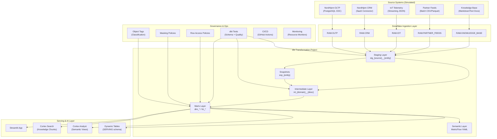
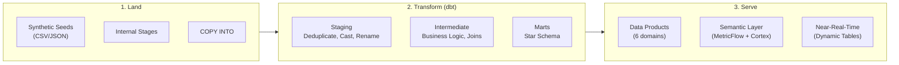
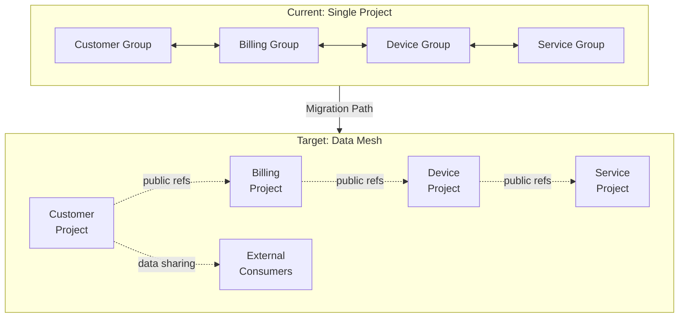

# Design Document — Lighthouse: AI-Ready Data Product Platform on Snowflake + dbt

## Overview

Lighthouse is a portfolio-grade data platform for NordHjem Energy, a fictional Nordic connected-home and energy services company. The platform demonstrates senior data engineering judgment across five architectural pillars:

1. **Snowflake Infrastructure** — Reproducible, environment-separated infrastructure with role-based access, warehouse sizing, and governance objects
2. **Simulated Ingestion** — Five ingestion patterns (CDC, SaaS, batch, streaming, unstructured) using synthetic seed data compatible with Snowflake Enterprise trial accounts
3. **dbt Transformation** — Three-layer ELT (staging → intermediate → marts) implementing Kimball star schema with conformed dimensions, multiple fact types, SCD Type 2 snapshots, and model governance
4. **Data Products & Semantic Layer** — Six governed data products with dbt Semantic Layer (MetricFlow) metrics, Snowflake semantic views for Cortex Analyst, and Cortex Search for unstructured retrieval
5. **Governance & Operations** — Classification, masking, row-level security, automated data quality testing, CI/CD, cost monitoring, and a documented evolution path toward data mesh

The platform follows an ELT architecture where Snowflake owns ingestion and platform infrastructure, and dbt owns all transformation logic. All ingestion is simulated with synthetic data so the entire platform can be deployed on a Snowflake Enterprise trial account.

### Key Design Decisions

- **Single dbt project** for MVP, with domain-aligned groups and model access controls preparing for future mesh decomposition
- **Kimball star schema** with conformed dimensions and an enterprise bus matrix — the proven approach for analytical data products
- **Dual semantic layer** — dbt Semantic Layer for BI tool consumption, Snowflake semantic views for Cortex Analyst — sharing the same physical mart layer to minimize duplication
- **Dynamic Tables** used selectively for near-real-time serving where dbt batch scheduling is insufficient
- **Synthetic seed data** designed to be production-schema-correct so swapping simulation for real connectors requires only changing the ingestion mechanism

## Architecture

### High-Level Architecture Diagram



### Data Flow Architecture



### Environment Strategy

| Environment | Database Prefix | Purpose | Warehouse Sizing |
|---|---|---|---|
| DEV | `LIGHTHOUSE_DEV_*` | Developer iteration, feature branches | X-Small, auto-suspend 60s |
| STAGING | `LIGHTHOUSE_STAGING_*` | CI validation, PR builds | X-Small, auto-suspend 60s |
| PROD | `LIGHTHOUSE_PROD_*` | Production serving | Per workload (see below) |

### Warehouse Strategy

| Warehouse | Size | Auto-Suspend | Workload |
|---|---|---|---|
| `INGESTION_WH` | X-Small | 60s | COPY INTO, seed loading |
| `TRANSFORM_WH` | Small | 120s | dbt build (staging, intermediate, marts) |
| `SERVING_WH` | Small | 60s | Streamlit queries, BI tool queries |
| `AI_WH` | Medium | 120s | Cortex Analyst, Cortex Search |


## Components and Interfaces

### Component 1: Snowflake Infrastructure Scripts

**Location:** `snowflake/infrastructure/`

Idempotent SQL scripts organized by concern, executable in dependency order via a single orchestration script.

| Script | Purpose | Key Objects |
|---|---|---|
| `01_databases.sql` | Create databases per environment and layer | `LIGHTHOUSE_{ENV}_RAW`, `LIGHTHOUSE_{ENV}_ANALYTICS`, `LIGHTHOUSE_{ENV}_SERVING` |
| `02_warehouses.sql` | Create and configure warehouses | `INGESTION_WH`, `TRANSFORM_WH`, `SERVING_WH`, `AI_WH` |
| `03_roles.sql` | Create role hierarchy | `LIGHTHOUSE_ADMIN` → `ENGINEER` → `TRANSFORMER` → `READER` |
| `04_grants.sql` | Grant privileges per role | Database, schema, table, warehouse grants |
| `05_schemas.sql` | Create schemas within databases | `RAW.OLTP`, `RAW.CRM`, `RAW.IOT`, `RAW.PARTNER_FEEDS`, `RAW.KNOWLEDGE_BASE`, `ANALYTICS.STAGING`, `ANALYTICS.INTERMEDIATE`, `ANALYTICS.MARTS`, `ANALYTICS.SNAPSHOTS`, `ANALYTICS.SEMANTIC`, `ANALYTICS.TEST_RESULTS`, `SERVING.REALTIME` |
| `06_stages.sql` | Create internal stages | Per-source stages for seed data loading |
| `07_integrations.sql` | Storage and API integrations | S3 integration (documented), API integration for Cortex |
| `08_file_formats.sql` | File format definitions | CSV, Parquet, JSON formats per source |
| `deploy.sql` | Orchestration script | Calls scripts 01–08 in order |

All scripts use `CREATE OR REPLACE` or `CREATE IF NOT EXISTS` for idempotent execution.

**Interface:** Shell script or SQL worksheet execution: `snowsql -f snowflake/infrastructure/deploy.sql -D env=PROD`

### Component 2: Simulated Ingestion Pipeline

**Location:** `snowflake/ingestion/` (SQL scripts) + `data/` (synthetic seed files)

Five ingestion patterns, each simulated with synthetic data but designed with production-correct schemas.

#### 2a. CDC Ingestion (OLTP)

**Source schema:** `RAW.OLTP`

Raw table structure (per entity):
```sql
CREATE TABLE RAW.OLTP.customers (
    -- CDC metadata
    _op           VARCHAR(10),      -- INSERT, UPDATE, DELETE
    _source_ts    TIMESTAMP_NTZ,    -- Source system change timestamp
    _loaded_at    TIMESTAMP_NTZ DEFAULT CURRENT_TIMESTAMP(),
    _connector_batch_id VARCHAR(50),
    -- Source columns
    customer_id   INTEGER,
    email         VARCHAR(255),
    first_name    VARCHAR(100),
    last_name     VARCHAR(100),
    -- ... all source columns
);
```

**Entities:** `customers`, `households`, `installations`, `devices`, `contracts`, `tariff_plans`, `products`, `services`, `invoices`, `invoice_line_items`, `payments`

**Seed data requirements:** Multiple records per natural key showing INSERT → UPDATE → UPDATE → DELETE patterns with realistic timestamps spanning 30+ days.

**Loading mechanism:** `PUT` files to internal stage → `COPY INTO` with metadata columns.

#### 2b. SaaS Ingestion (CRM)

**Source schema:** `RAW.CRM`

Raw table structure (per object):
```sql
CREATE TABLE RAW.CRM.accounts (
    _loaded_at    TIMESTAMP_NTZ DEFAULT CURRENT_TIMESTAMP(),
    _sync_id      VARCHAR(50),
    _is_deleted   BOOLEAN DEFAULT FALSE,
    -- Source columns
    account_id    VARCHAR(50),
    account_name  VARCHAR(255),
    -- ... all source columns
);
```

**Objects:** `accounts`, `contacts`, `cases`, `case_comments`, `opportunities`, `tasks`, `campaigns`, `campaign_members`

**Seed data requirements:** Multiple sync batches, soft-deleted records, incremental changes.

#### 2c. Batch File Ingestion (Partner Feeds)

**Source schema:** `RAW.PARTNER_FEEDS`

**File types:**
- `grid_usage_readings` — daily CSV from energy grid operator
- `installation_certifications` — weekly Parquet from partner installers
- `product_catalog_updates` — monthly CSV from manufacturer

Raw table metadata columns: `_loaded_at`, `_source_file_name`, `_source_file_row_number`

**Error handling:** Files failing schema validation are routed to a `quarantine` stage with error logging to a `RAW.PARTNER_FEEDS._file_load_errors` table.

#### 2d. Streaming Ingestion (IoT)

**Source schema:** `RAW.IOT`

```sql
CREATE TABLE RAW.IOT.telemetry_events (
    event_data    VARIANT,           -- Full JSON payload
    device_id     VARCHAR(50),       -- Extracted for partitioning
    event_type    VARCHAR(50),       -- energy_reading, device_status, temperature_reading, alert_event
    event_timestamp TIMESTAMP_NTZ,   -- Source event time (may be out of order)
    _loaded_at    TIMESTAMP_NTZ DEFAULT CURRENT_TIMESTAMP(),
    _ingestion_date DATE DEFAULT CURRENT_DATE()  -- Partition column
);
```

**Event types:** `energy_reading`, `device_status`, `temperature_reading`, `alert_event`

**Design decision:** `event_timestamp` (source) is preserved separately from `_loaded_at` (platform) to enable downstream deduplication and reordering of late-arriving events. Partitioning by `_ingestion_date` supports efficient pruning.

#### 2e. Unstructured Content Ingestion (Knowledge Base)

**Source schema:** `RAW.KNOWLEDGE_BASE`

```sql
-- Document tracking table
CREATE TABLE RAW.KNOWLEDGE_BASE.documents (
    document_id     VARCHAR(50),
    file_name       VARCHAR(255),
    file_type       VARCHAR(20),     -- markdown, text
    source_path     VARCHAR(500),
    category        VARCHAR(50),     -- manual, procedure, policy, support_article
    _loaded_at      TIMESTAMP_NTZ DEFAULT CURRENT_TIMESTAMP()
);

-- Extracted text content
CREATE TABLE RAW.KNOWLEDGE_BASE.document_text (
    document_id     VARCHAR(50),
    extracted_text  VARCHAR(16777216),  -- Large text field
    _extracted_at   TIMESTAMP_NTZ DEFAULT CURRENT_TIMESTAMP()
);

-- Chunked content for search indexing
CREATE TABLE RAW.KNOWLEDGE_BASE.document_chunks (
    chunk_id              VARCHAR(50),
    document_id           VARCHAR(50),
    chunk_sequence_number INTEGER,
    chunk_text            VARCHAR(16777216),
    _chunked_at           TIMESTAMP_NTZ DEFAULT CURRENT_TIMESTAMP()
);
```

**Chunking strategy:** ~512 tokens per chunk with 50-token overlap, implemented via a Snowflake stored procedure using string functions on pre-formatted text.

**Synthetic documents:** 2 product manuals, 2 service procedures, 1 policy document, 2 support articles (Markdown format).

### Component 3: dbt Transformation Project

**Location:** `dbt/`

#### Project Structure

```
dbt/
├── dbt_project.yml
├── packages.yml              # dbt_utils, dbt_date, elementary
├── profiles.yml.example      # Snowflake connection template
├── models/
│   ├── staging/
│   │   ├── oltp/             # stg_oltp__customers, stg_oltp__contracts, ...
│   │   ├── crm/              # stg_crm__accounts, stg_crm__cases, ...
│   │   ├── iot/              # stg_iot__energy_readings, stg_iot__device_status, ...
│   │   ├── partner_feeds/    # stg_partner__grid_usage, ...
│   │   └── knowledge_base/   # stg_kb__documents, stg_kb__chunks
│   ├── intermediate/
│   │   ├── customer/         # int_customer__unified_profile, ...
│   │   ├── billing/          # int_billing__invoice_enriched, ...
│   │   ├── device/           # int_device__lifecycle, int_device__telemetry_daily, ...
│   │   └── service/          # int_service__ticket_enriched, ...
│   └── marts/
│       ├── core/             # dim_customer, dim_household, dim_device, dim_product, dim_contract, dim_date, dim_time
│       ├── billing/          # fct_invoices, fct_payments, fct_contract_lifecycle
│       ├── device/           # fct_energy_usage_daily, fct_device_telemetry
│       ├── service/          # fct_service_ticket_lifecycle
│       ├── customer/         # customer_360
│       └── knowledge/        # knowledge_chunks
├── snapshots/
│   ├── snp_customers.sql
│   └── snp_contracts.sql
├── seeds/
│   ├── dim_date_seed.csv
│   ├── product_catalog.csv
│   └── ...
├── macros/
│   ├── generate_schema_name.sql
│   ├── test_scd2_no_overlap.sql
│   ├── test_referential_integrity.sql
│   └── test_surrogate_key_collision.sql
├── tests/
│   ├── unit/
│   │   ├── test_customer_entity_matching.sql
│   │   ├── test_contract_status_derivation.sql
│   │   └── test_energy_usage_daily_aggregation.sql
│   └── generic/
│       ├── test_pii_masking_coverage.sql
│       └── test_volume_anomaly.sql
└── semantic/                         # (Legacy location — in v1.12+ metrics are defined inline on model YAML)
    ├── sem_fct_invoices.yml          # Only needed if using pre-v1.12 separate semantic_models syntax
    ├── sem_fct_energy_usage_daily.yml
    ├── sem_fct_service_ticket_lifecycle.yml
    ├── sem_dim_customer.yml
    └── sem_dim_date.yml
```

#### Staging Layer Design

Each staging model follows a consistent pattern:

```sql
-- stg_oltp__customers.sql
WITH source AS (
    SELECT * FROM {{ source('oltp', 'customers') }}
),
deduplicated AS (
    SELECT *,
        ROW_NUMBER() OVER (
            PARTITION BY customer_id
            ORDER BY _source_ts DESC
        ) AS _row_num
    FROM source
    WHERE _op != 'DELETE'
),
renamed AS (
    SELECT
        -- Keys first
        customer_id,
        -- Attributes
        LOWER(email) AS email,
        INITCAP(first_name) AS first_name,
        INITCAP(last_name) AS last_name,
        -- ... cast and rename all columns
        -- Metadata last
        _source_ts,
        _loaded_at,
        _connector_batch_id
    FROM deduplicated
    WHERE _row_num = 1
)
SELECT * FROM renamed
```

**Materialization strategy:**
- `view` — low-volume reference sources (product catalog, tariff plans, geography)
- `incremental` with `_loaded_at` filtering — high-volume sources (IoT telemetry, CDC entities)

**Source freshness configuration:**
| Source | Warn After | Error After |
|---|---|---|
| OLTP CDC | 30 min | 60 min |
| CRM | 90 min | 180 min |
| IoT | 10 min | 30 min |
| Partner Feeds | 36 hours | 72 hours |

#### Intermediate Layer Design

Business logic and cross-source harmonization. Key models:

- `int_customer__unified_profile` — Deterministic entity matching between OLTP customers and CRM contacts using shared natural keys (email, customer_id). Non-matches are preserved with a `match_status` flag.
- `int_billing__invoice_enriched` — Joins invoice line items with product, contract, and customer context.
- `int_device__lifecycle` — Derives device lifecycle state (provisioned → active → degraded → decommissioned) from telemetry patterns and installation records.
- `int_device__telemetry_daily` — Aggregates raw telemetry into daily device-level summaries (total kWh, peak usage, avg temperature, reading count).
- `int_service__ticket_enriched` — Maps CRM case data to service ticket model with severity mapping and milestone extraction.

**Materialization:** `ephemeral` or `view` for lightweight transforms; `table` for heavy cross-source joins.
**Access:** All intermediate models set to `protected`.

#### Marts Layer Design — Kimball Star Schema

##### Enterprise Bus Matrix

| Business Process (Fact) | dim_customer | dim_household | dim_device | dim_product | dim_contract | dim_date | dim_time |
|---|---|---|---|---|---|---|---|
| Invoicing (`fct_invoices`) | ✓ | ✓ | | ✓ | ✓ | ✓ | |
| Payments (`fct_payments`) | ✓ | ✓ | | | ✓ | ✓ | |
| Energy Usage (`fct_energy_usage_daily`) | ✓ | ✓ | ✓ | ✓ | | ✓ | ✓ |
| Service Interactions (`fct_service_ticket_lifecycle`) | ✓ | ✓ | ✓ | | ✓ | ✓ | |
| Device Telemetry (`fct_device_telemetry`) | | ✓ | ✓ | | | ✓ | ✓ |
| Contract Lifecycle (`fct_contract_lifecycle`) | ✓ | ✓ | | ✓ | ✓ | ✓ | |

##### Conformed Dimensions

All dimensions use `dbt_utils.generate_surrogate_key()` for deterministic surrogate key generation.

| Dimension | Grain | SCD Strategy | Key Attributes |
|---|---|---|---|
| `dim_customer` | One row per customer (SCD2: per version) | SCD Type 2 (via snapshot) | customer_sk, customer_id, email, name, segment, region, valid_from, valid_to, is_current |
| `dim_household` | One row per household/site | SCD Type 1 | household_sk, household_id, address, postal_code, municipality, country |
| `dim_device` | One row per physical device | SCD Type 1 | device_sk, device_serial, device_type, manufacturer, model, firmware_version |
| `dim_product` | One row per product/service offering | SCD Type 1 | product_sk, product_id, product_name, category, pricing_tier |
| `dim_contract` | One row per contract version (SCD2) | SCD Type 2 (via snapshot) | contract_sk, contract_id, contract_type, status, start_date, end_date, valid_from, valid_to, is_current |
| `dim_date` | One row per calendar date (2020–2030) | Static (seed/macro) | date_key, full_date, day_of_week, week_number_iso, month, quarter, year, is_weekend, is_danish_public_holiday, fiscal_year, fiscal_quarter |
| `dim_time` | One row per minute of day (1440 rows) | Static (seed/macro) | time_key, hour, minute, time_of_day_band, is_business_hour |
| `dim_geography` | One row per postal code/municipality | SCD Type 1 | geography_sk, postal_code, municipality, region, country |

##### Fact Tables

**Transaction Fact — `fct_invoices`**
- Grain: one row per invoice line item
- Foreign keys: customer_sk, household_sk, product_sk, contract_sk, date_key
- Measures: amount, quantity, tax_amount, net_amount (all additive)

**Periodic Snapshot — `fct_energy_usage_daily`**
- Grain: one row per device per day
- Foreign keys: device_sk, household_sk, customer_sk, product_sk, date_key
- Measures: total_kwh, peak_kwh, avg_temperature, reading_count

**Accumulating Snapshot — `fct_service_ticket_lifecycle`**
- Grain: one row per service ticket
- Foreign keys: customer_sk, household_sk, device_sk, contract_sk, date_key (opened)
- Milestone dates: opened_at, assigned_at, first_response_at, resolved_at, closed_at
- Duration measures: time_to_assign, time_to_first_response, time_to_resolve, time_to_close

**Transaction Fact — `fct_payments`**
- Grain: one row per payment
- Foreign keys: customer_sk, household_sk, contract_sk, date_key
- Measures: payment_amount, is_late_payment

**Accumulating Snapshot — `fct_contract_lifecycle`**
- Grain: one row per contract version
- Milestone dates: created_at, activated_at, renewed_at, cancelled_at
- Duration measures: time_to_activate, contract_duration

**Transaction Fact — `fct_device_telemetry`**
- Grain: one row per telemetry event
- Foreign keys: device_sk, household_sk, date_key, time_key
- Measures: reading_value, event_type

##### Bridge Table

**`bridge_household_device`**
- Grain: one row per household-device assignment period
- Columns: household_sk, device_sk, effective_from, effective_to
- Resolves many-to-many relationship between households and devices over time

##### Model Governance

All mart models enforce:
- **Model contracts** — column names, data types, not-null constraints on keys
- **Model access** — `public` for all dimensions and facts intended for data product consumption
- **Model versions** — starting at v1 for public-facing models
- **Documentation** — descriptions, column descriptions, grain statements on every model
- **Domain groups** — models organized into `customer`, `billing`, `device`, `service` groups


### Component 4: dbt Snapshots

**Location:** `dbt/snapshots/`

| Snapshot | Source | Strategy | Tracked Columns |
|---|---|---|---|
| `snp_customers` | `stg_oltp__customers` | `timestamp` (`updated_at`) | All attribute columns (name, email, segment, region, status) |
| `snp_contracts` | `stg_oltp__contracts` | `timestamp` (`updated_at`) | contract_type, status, tariff_plan_id, end_date |

**Target schema:** `ANALYTICS.SNAPSHOTS` (dedicated schema, separate from staging/marts)

**Metadata columns:** `dbt_valid_from`, `dbt_valid_to`, `dbt_scd_id`, `dbt_updated_at`

**DAG ordering:** Snapshots run after staging models and before intermediate/marts models that depend on historical dimension data. Configured via dbt build selector: `dbt build --select staging+ snapshots+ intermediate+ marts+`

### Component 5: Data Products

Six governed data products, each with explicit purpose, owner, consumers, grain, freshness SLA, and quality expectations.

#### 5a. Customer 360

| Attribute | Value |
|---|---|
| Interface | `customer_360` (one row per customer) |
| Owner | Customer Domain Team |
| Consumers | AI models, service apps, analytics teams |
| Freshness SLA | 60 minutes |
| Sources | OLTP (demographics, account status), CRM (interaction summary, satisfaction), derived metrics (LTV inputs, contract count, active device count) |
| Governance | PII classification tags on name/email/phone/address; dynamic masking for `LIGHTHOUSE_READER`; model contract enforced |

#### 5b. Contract and Revenue

| Attribute | Value |
|---|---|
| Interfaces | `fct_invoices` (line item grain), `fct_payments` (payment grain), `fct_contract_lifecycle` (contract version grain), `dim_contract` (SCD2) |
| Owner | Billing Domain Team |
| Consumers | Revenue Reporting Dashboard, Contract Renewal Prediction Model |
| Freshness SLA | 60 minutes |
| Governance | Model contracts + versioning (v1); row-level security by region on `fct_invoices`; dbt exposures for downstream consumers |

#### 5c. Device and Usage

| Attribute | Value |
|---|---|
| Interfaces | `fct_energy_usage_daily` (device-day grain), `fct_device_telemetry` (event grain), `dim_device`, `dim_household` |
| Owner | Device Domain Team |
| Consumers | Device Health Anomaly Detection Model |
| Freshness SLA | Daily snapshot: 120 min after day-end; Telemetry: 30 min |
| Governance | Model contracts; accepted range tests on energy readings (0–9999 kWh); recency tests; referential integrity tests |

#### 5d. Service Operations

| Attribute | Value |
|---|---|
| Interfaces | `fct_service_ticket_lifecycle` (ticket grain), service interaction summary, `dim_customer`, `dim_household`, `dim_device` |
| Owner | Service Domain Team |
| Consumers | Service SLA Compliance Monitoring |
| Freshness SLA | 60 minutes |
| Governance | Model contracts; milestone date ordering tests; accepted values for ticket status/severity |

#### 5e. Reference and Semantic

| Attribute | Value |
|---|---|
| Interfaces | `dim_date`, `dim_time`, `dim_product`, `dim_geography` |
| Owner | Platform Team |
| Consumers | All other data products |
| Governance | Model contracts; `public` access; deterministic generation (seed/macro) |

`dim_date` covers 2020–2030 with ISO week numbers, Danish public holidays, and fiscal calendar. `dim_time` covers all 1440 minutes with time-of-day bands and business hour flags.

#### 5f. AI-Ready Knowledge Product

| Attribute | Value |
|---|---|
| Interfaces | `knowledge_chunks` (chunk grain) |
| Owner | Platform Team |
| Consumers | Support Agent Copilot (Cortex Search) |
| Freshness SLA | 24 hours |
| Governance | Referential integrity to document tracking table; Cortex Search service indexed on `chunk_text` with filterable `document_category` and `document_title` |

### Component 6: dbt Semantic Layer (MetricFlow)

**Location:** Defined inline on mart model YAML files (dbt v1.12+ syntax)

In dbt v1.12+, semantic models and metrics are defined directly on the model's YAML configuration using `semantic_model: enabled: true` and inline `metrics:` blocks. This replaces the older separate `semantic_models:` YAML files and keeps semantic definitions co-located with the models they describe.

#### Example: fct_invoices semantic configuration

```yaml
models:
  - name: fct_invoices
    description: "Invoice line items — grain: one row per invoice line item"
    config:
      contract:
        enforced: true
      access: public
    
    semantic_model:
      enabled: true
    
    agg_time_dimension: invoice_date
    
    columns:
      - name: invoice_line_sk
        description: "Surrogate key for invoice line item"
        data_type: varchar
        entity:
          name: invoice_line
          type: primary
        constraints:
          - type: not_null
      
      - name: customer_sk
        description: "Foreign key to dim_customer"
        data_type: varchar
        entity:
          name: customer
          type: foreign
      
      - name: date_key
        description: "Foreign key to dim_date"
        data_type: integer
        entity:
          name: date
          type: foreign
      
      - name: amount
        description: "Invoice line item amount"
        data_type: number
      
      - name: invoice_date
        description: "Date of the invoice"
        data_type: date
        granularity: day
        dimension:
          type: time
    
    metrics:
      - name: total_revenue
        type: simple
        description: "Total revenue — sum of invoice line item amounts"
        label: Total Revenue
        agg: sum
        expr: amount
      
      - name: invoice_count
        type: simple
        description: "Count of invoice line items"
        label: Invoice Count
        agg: count
        expr: invoice_line_sk
```

#### Semantic Models

| Model | Entities | Key Measures |
|---|---|---|
| `fct_invoices` | invoice_line (primary), customer, household, product, contract, date (foreign) | amount, quantity, tax_amount |
| `fct_energy_usage_daily` | usage (primary), device, household, customer, date (foreign) | total_kwh, peak_kwh, avg_temperature |
| `fct_service_ticket_lifecycle` | ticket (primary), customer, household, device, date (foreign) | time_to_first_response, time_to_resolve |
| `dim_customer` | customer (primary) | — |
| `dim_date` | date (primary) | — |

#### Governed Metrics

| Metric | Type | Definition | Sliceable By |
|---|---|---|---|
| `total_revenue` | `simple` (sum) | Sum of invoice line item amounts | customer, household, product, contract type, date, geography |
| `average_daily_energy_consumption` | `simple` (avg) | Average of daily kWh per device | device, household, date, device type |
| `median_first_response_time` | `simple` (median) | Median duration from ticket opened to first response | customer, date, severity |
| `active_customer_count` | `simple` (count_distinct) | Distinct customers with active contracts | date, region, segment |
| `device_uptime_rate` | `derived` | Percentage of devices with "online" status in latest telemetry window | device type, household, date |

### Component 7: Snowflake Semantic Views for Cortex Analyst

**Location:** `snowflake/semantic/`

Snowflake now supports `CREATE SEMANTIC VIEW` as a first-class SQL object — this replaces the older pattern of deploying YAML files to a stage. Semantic views define tables, relationships, facts, dimensions, and metrics directly in SQL, and integrate natively with Cortex Analyst for natural-language querying.

**Initial domain:** Contract and Revenue (covering `fct_invoices`, `fct_payments`, `dim_customer`, `dim_contract`, `dim_product`, `dim_date`)

```sql
CREATE OR REPLACE SEMANTIC VIEW ANALYTICS.SEMANTIC.contract_revenue_analysis

  TABLES (
    invoices AS LIGHTHOUSE_PROD_ANALYTICS.MARTS.fct_invoices
      PRIMARY KEY (invoice_line_sk)
      COMMENT = 'Invoice line items — grain: one row per invoice line',
    payments AS LIGHTHOUSE_PROD_ANALYTICS.MARTS.fct_payments
      PRIMARY KEY (payment_sk)
      COMMENT = 'Individual payments — grain: one row per payment',
    customers AS LIGHTHOUSE_PROD_ANALYTICS.MARTS.dim_customer
      PRIMARY KEY (customer_sk)
      COMMENT = 'Customer dimension (SCD2) — grain: one row per customer version',
    contracts AS LIGHTHOUSE_PROD_ANALYTICS.MARTS.dim_contract
      PRIMARY KEY (contract_sk)
      COMMENT = 'Contract dimension (SCD2) — grain: one row per contract version',
    products AS LIGHTHOUSE_PROD_ANALYTICS.MARTS.dim_product
      PRIMARY KEY (product_sk)
      COMMENT = 'Product/service offering dimension',
    dates AS LIGHTHOUSE_PROD_ANALYTICS.MARTS.dim_date
      PRIMARY KEY (date_key)
      COMMENT = 'Calendar date dimension (2020–2030)'
  )

  RELATIONSHIPS (
    invoices_to_customers AS invoices (customer_sk) REFERENCES customers,
    invoices_to_contracts AS invoices (contract_sk) REFERENCES contracts,
    invoices_to_products AS invoices (product_sk) REFERENCES products,
    invoices_to_dates AS invoices (date_key) REFERENCES dates,
    payments_to_customers AS payments (customer_sk) REFERENCES customers,
    payments_to_contracts AS payments (contract_sk) REFERENCES contracts,
    payments_to_dates AS payments (date_key) REFERENCES dates
  )

  FACTS (
    invoices.net_amount AS net_amount COMMENT = 'Net invoice amount after tax',
    invoices.tax_amount AS tax_amount COMMENT = 'Tax amount per line item',
    invoices.quantity AS quantity COMMENT = 'Quantity per line item',
    payments.payment_amount AS payment_amount COMMENT = 'Payment amount'
  )

  DIMENSIONS (
    customers.customer_name AS CONCAT(first_name, ' ', last_name)
      WITH SYNONYMS = ('customer name', 'client name')
      COMMENT = 'Full customer name',
    customers.segment AS segment COMMENT = 'Customer segment',
    customers.region AS region COMMENT = 'Customer region',
    contracts.contract_type AS contract_type COMMENT = 'Type of contract',
    contracts.status AS contract_status COMMENT = 'Current contract status',
    products.product_name AS product_name COMMENT = 'Product or service name',
    products.category AS product_category COMMENT = 'Product category',
    dates.full_date AS order_date COMMENT = 'Invoice/payment date',
    dates.month AS month COMMENT = 'Month number',
    dates.quarter AS quarter COMMENT = 'Quarter number',
    dates.year AS year COMMENT = 'Calendar year'
  )

  METRICS (
    invoices.total_revenue AS SUM(invoices.net_amount)
      COMMENT = 'Total revenue (sum of net invoice amounts)',
    invoices.average_invoice_amount AS AVG(invoices.net_amount)
      COMMENT = 'Average invoice line amount',
    invoices.invoice_count AS COUNT(invoices.invoice_line_sk)
      COMMENT = 'Total number of invoice line items',
    payments.total_payments AS SUM(payments.payment_amount)
      COMMENT = 'Total payment amount received',
    customers.customer_count AS COUNT(DISTINCT customers.customer_sk)
      COMMENT = 'Number of distinct customers'
  )

  COMMENT = 'Semantic view for contract and revenue analysis — enables Cortex Analyst natural-language querying';
```

**Verified queries** (sample natural-language questions for Cortex Analyst):
1. "What was total revenue last quarter?"
2. "Which customers have the highest invoice amounts this year?"
3. "Show me monthly revenue trend by product category"
4. "How many contracts were renewed vs cancelled last month?"
5. "What is the average invoice amount by customer segment?"

**Duplication minimization strategy:** dbt marts are the single physical source for both semantic layers. dbt Semantic Layer defines metrics for BI tool consumption (Tableau, Looker, etc.). Snowflake semantic views define the same concepts for Cortex Analyst consumption. A mapping document in `docs/` tracks which metrics exist in which layer.

### Component 8: Cortex Search Service

**Location:** `snowflake/cortex/`

```sql
CREATE OR REPLACE CORTEX SEARCH SERVICE knowledge_search_service
  ON chunk_text
  ATTRIBUTES document_category, document_title
  WAREHOUSE = AI_WH
  TARGET_LAG = '24 hours'
  AS (
    SELECT
        chunk_id,
        chunk_text,
        document_title,
        document_category,
        source_file_name,
        _loaded_at
    FROM ANALYTICS.MARTS.knowledge_chunks
  );
```

**Query interface:**
```sql
SELECT *
FROM TABLE(
    knowledge_search_service!SEARCH(
        query => 'How to reset a smart thermostat',
        columns => ['chunk_text', 'document_title', 'document_category'],
        filter => {'@eq': {'document_category': 'manual'}},
        limit => 5
    )
);
```

### Component 9: Dynamic Tables (Near-Real-Time Serving)

**Location:** `snowflake/serving/`

```sql
CREATE OR REPLACE DYNAMIC TABLE SERVING.REALTIME.device_latest_status
    TARGET_LAG = '5 minutes'
    WAREHOUSE = SERVING_WH
AS
SELECT
    device_id,
    event_type,
    event_timestamp,
    event_data,
    _loaded_at
FROM (
    SELECT *,
        ROW_NUMBER() OVER (
            PARTITION BY device_id
            ORDER BY event_timestamp DESC
        ) AS rn
    FROM RAW.IOT.telemetry_events
    WHERE event_type IN ('device_status', 'energy_reading')
)
WHERE rn = 1;
```

**Design rationale:** This use case requires sub-5-minute freshness for operational device monitoring. dbt's batch scheduling (minimum ~15 min with orchestration overhead) cannot meet this SLA. Dynamic Tables provide declarative, Snowflake-managed refresh with guaranteed target lag. The Dynamic Table reads from the raw/staging layer and is exposed in a dedicated `SERVING` schema, avoiding duplication of dbt mart logic. See ADR in Requirement 25 tradeoff analysis.

### Component 10: Streamlit in Snowflake Application

**Location:** `streamlit/`

A lightweight internal application demonstrating two consumption patterns:

1. **Structured data query** — Customer/contract lookup from the dimensional model (queries `customer_360`, `dim_contract`, `fct_invoices`)
2. **Unstructured search** — Cortex Search over the knowledge base (queries `knowledge_search_service`)

**Architecture:**
- Runs under `LIGHTHOUSE_READER` role
- Queries only from `ANALYTICS.MARTS` and `SERVING` schemas (public data product interfaces)
- Respects RBAC — masked PII for reader role, row-level security on invoices
- Single Python file deployable to Snowflake's Streamlit runtime

**Files:**
- `streamlit/app.py` — Main application
- `streamlit/README.md` — Deployment instructions and expected UI description

### Component 11: Governance Objects

**Location:** `snowflake/governance/`

#### Classification Tags

```sql
CREATE TAG IF NOT EXISTS LIGHTHOUSE.GOVERNANCE.CLASSIFICATION
    ALLOWED_VALUES 'PII', 'SENSITIVE', 'INTERNAL', 'PUBLIC';
```

Applied to mart columns:
- `PII` — customer name, email, phone, address
- `SENSITIVE` — invoice amounts, payment details
- `INTERNAL` — internal IDs, operational metadata
- `PUBLIC` — aggregated metrics, reference data

#### Dynamic Data Masking

```sql
CREATE OR REPLACE MASKING POLICY pii_string_mask AS (val STRING)
RETURNS STRING ->
    CASE
        WHEN CURRENT_ROLE() IN ('LIGHTHOUSE_ENGINEER', 'LIGHTHOUSE_ADMIN')
        THEN val
        ELSE '***MASKED***'
    END;
```

Separate policies for strings (full mask), dates (null), and numbers (null).

#### Row Access Policy

```sql
CREATE OR REPLACE ROW ACCESS POLICY region_access_policy AS (region_col VARCHAR)
RETURNS BOOLEAN ->
    CURRENT_ROLE() IN ('LIGHTHOUSE_ENGINEER', 'LIGHTHOUSE_ADMIN')
    OR region_col = CURRENT_SESSION()::VARIANT:region::VARCHAR;
```

Applied to `fct_invoices` as a demonstration of regional data access restriction.

#### Governance Documentation

A mapping document (`docs/governance-mapping.md`) tracks which policies apply to which tables and columns.

### Component 12: CI/CD Pipelines

**Location:** `.github/workflows/`

#### CI Pipeline (`ci.yml`) — On Pull Request

```yaml
# Triggered on PR to main
steps:
  - dbt deps
  - dbt build --select state:modified+ --defer --state prod-manifest/
  - dbt test --select state:modified+
  - Report results (pass/fail with test names and error messages)
  # Blocks merge on test failure
```

Uses `state:modified+` selection to minimize build time and Snowflake compute cost. Runs against a CI-specific database (`LIGHTHOUSE_STAGING_*`).

#### CD Pipeline (`cd.yml`) — On Merge to Main

```yaml
# Triggered on merge to main
steps:
  - dbt deps
  - dbt build --target prod
  - dbt test --target prod
  - Upload manifest artifact for state comparison
```

Full build against `LIGHTHOUSE_PROD_*` with complete test execution.

#### Infrastructure Deployment

A separate workflow or manual step executes `snowflake/infrastructure/deploy.sql` per environment for database, warehouse, role, and governance changes.

### Component 13: Monitoring and Cost Controls

**Location:** `snowflake/monitoring/`

#### Resource Monitors

```sql
CREATE OR REPLACE RESOURCE MONITOR lighthouse_monitor
    WITH CREDIT_QUOTA = 100  -- Monthly budget
    TRIGGERS
        ON 75 PERCENT DO NOTIFY
        ON 90 PERCENT DO NOTIFY
        ON 100 PERCENT DO SUSPEND;
```

Applied per warehouse.

#### Monitoring Query/Task

A Snowflake Task (or SQL script) queries `SNOWFLAKE.ACCOUNT_USAGE` views to report:
- Daily credit consumption by warehouse
- Longest-running queries (>30s)
- Failed task executions
- Stale data product freshness (based on `_loaded_at` recency)

#### Clustering Keys

Applied to high-volume fact tables for time-range query optimization:
- `fct_energy_usage_daily` — clustered on `date_key`
- `fct_device_telemetry` — clustered on `date_key`

#### Test Results Monitoring

dbt test results stored in `ANALYTICS.TEST_RESULTS` schema (via elementary or custom `on-run-end` hook). A Snowflake Task reads from test results history and triggers alerts when error-severity tests fail in production.


## Data Models

### Entity Relationship Diagram — Dimensional Model

```mermaid
erDiagram
    dim_customer ||--o{ fct_invoices : "customer_sk"
    dim_customer ||--o{ fct_payments : "customer_sk"
    dim_customer ||--o{ fct_energy_usage_daily : "customer_sk"
    dim_customer ||--o{ fct_service_ticket_lifecycle : "customer_sk"
    dim_customer ||--o{ fct_contract_lifecycle : "customer_sk"
    dim_customer ||--|| customer_360 : "customer_sk"

    dim_household ||--o{ fct_invoices : "household_sk"
    dim_household ||--o{ fct_payments : "household_sk"
    dim_household ||--o{ fct_energy_usage_daily : "household_sk"
    dim_household ||--o{ fct_service_ticket_lifecycle : "household_sk"
    dim_household ||--o{ fct_device_telemetry : "household_sk"
    dim_household ||--o{ bridge_household_device : "household_sk"

    dim_device ||--o{ fct_energy_usage_daily : "device_sk"
    dim_device ||--o{ fct_device_telemetry : "device_sk"
    dim_device ||--o{ fct_service_ticket_lifecycle : "device_sk"
    dim_device ||--o{ bridge_household_device : "device_sk"

    dim_product ||--o{ fct_invoices : "product_sk"
    dim_product ||--o{ fct_energy_usage_daily : "product_sk"
    dim_product ||--o{ fct_contract_lifecycle : "product_sk"

    dim_contract ||--o{ fct_invoices : "contract_sk"
    dim_contract ||--o{ fct_payments : "contract_sk"
    dim_contract ||--o{ fct_service_ticket_lifecycle : "contract_sk"
    dim_contract ||--o{ fct_contract_lifecycle : "contract_sk"

    dim_date ||--o{ fct_invoices : "date_key"
    dim_date ||--o{ fct_payments : "date_key"
    dim_date ||--o{ fct_energy_usage_daily : "date_key"
    dim_date ||--o{ fct_service_ticket_lifecycle : "date_key"
    dim_date ||--o{ fct_device_telemetry : "date_key"
    dim_date ||--o{ fct_contract_lifecycle : "date_key"

    dim_time ||--o{ fct_energy_usage_daily : "time_key"
    dim_time ||--o{ fct_device_telemetry : "time_key"

    dim_customer {
        string customer_sk PK
        integer customer_id NK
        string email
        string first_name
        string last_name
        string segment
        string region
        string status
        timestamp valid_from
        timestamp valid_to
        boolean is_current
    }

    dim_household {
        string household_sk PK
        integer household_id NK
        string address
        string postal_code
        string municipality
        string country
    }

    dim_device {
        string device_sk PK
        string device_serial NK
        string device_type
        string manufacturer
        string model
        string firmware_version
        string lifecycle_state
    }

    dim_product {
        string product_sk PK
        integer product_id NK
        string product_name
        string category
        string pricing_tier
    }

    dim_contract {
        string contract_sk PK
        integer contract_id NK
        string contract_type
        string status
        date start_date
        date end_date
        timestamp valid_from
        timestamp valid_to
        boolean is_current
    }

    dim_date {
        integer date_key PK
        date full_date
        string day_of_week
        integer week_number_iso
        integer month
        integer quarter
        integer year
        boolean is_weekend
        boolean is_danish_public_holiday
        integer fiscal_year
        integer fiscal_quarter
    }

    dim_time {
        integer time_key PK
        integer hour
        integer minute
        string time_of_day_band
        boolean is_business_hour
    }

    fct_invoices {
        string invoice_line_sk PK
        string customer_sk FK
        string household_sk FK
        string product_sk FK
        string contract_sk FK
        integer date_key FK
        number amount
        integer quantity
        number tax_amount
        number net_amount
    }

    fct_payments {
        string payment_sk PK
        string customer_sk FK
        string household_sk FK
        string contract_sk FK
        integer date_key FK
        number payment_amount
        boolean is_late_payment
    }

    fct_energy_usage_daily {
        string usage_sk PK
        string device_sk FK
        string household_sk FK
        string customer_sk FK
        string product_sk FK
        integer date_key FK
        integer time_key FK
        number total_kwh
        number peak_kwh
        number avg_temperature
        integer reading_count
    }

    fct_service_ticket_lifecycle {
        string ticket_sk PK
        string customer_sk FK
        string household_sk FK
        string device_sk FK
        string contract_sk FK
        integer date_key FK
        timestamp opened_at
        timestamp assigned_at
        timestamp first_response_at
        timestamp resolved_at
        timestamp closed_at
        number time_to_assign_hours
        number time_to_first_response_hours
        number time_to_resolve_hours
        number time_to_close_hours
    }

    fct_device_telemetry {
        string telemetry_sk PK
        string device_sk FK
        string household_sk FK
        integer date_key FK
        integer time_key FK
        string event_type
        number reading_value
        timestamp event_timestamp
    }

    fct_contract_lifecycle {
        string contract_lifecycle_sk PK
        string customer_sk FK
        string household_sk FK
        string product_sk FK
        string contract_sk FK
        integer date_key FK
        timestamp created_at
        timestamp activated_at
        timestamp renewed_at
        timestamp cancelled_at
        number time_to_activate_days
        number contract_duration_days
    }

    bridge_household_device {
        string household_sk FK
        string device_sk FK
        date effective_from
        date effective_to
    }

    customer_360 {
        string customer_sk FK
        integer customer_id
        string email
        string full_name
        string segment
        string region
        string account_status
        integer total_contracts
        integer active_device_count
        number lifetime_invoice_total
        number avg_satisfaction_score
        integer total_service_tickets
        timestamp last_interaction_date
    }

    knowledge_chunks {
        string chunk_id PK
        string document_id FK
        integer chunk_sequence_number
        string chunk_text
        string document_title
        string document_category
        string source_file_name
        timestamp _loaded_at
    }
```

### Database Schema Layout

```
LIGHTHOUSE_PROD_RAW
├── OLTP          (customers, households, installations, devices, contracts, ...)
├── CRM           (accounts, contacts, cases, case_comments, opportunities, ...)
├── IOT           (telemetry_events)
├── PARTNER_FEEDS (grid_usage_readings, installation_certifications, product_catalog_updates, _file_load_errors)
└── KNOWLEDGE_BASE (documents, document_text, document_chunks)

LIGHTHOUSE_PROD_ANALYTICS
├── STAGING       (stg_oltp__*, stg_crm__*, stg_iot__*, stg_partner__*, stg_kb__*)
├── INTERMEDIATE  (int_customer__*, int_billing__*, int_device__*, int_service__*)
├── MARTS         (dim_*, fct_*, customer_360, knowledge_chunks, bridge_*)
├── SNAPSHOTS     (snp_customers, snp_contracts)
├── SEMANTIC      (MetricFlow artifacts, Cortex Analyst semantic model stage)
└── TEST_RESULTS  (dbt test result history)

LIGHTHOUSE_PROD_SERVING
└── REALTIME      (device_latest_status — Dynamic Table)
```

## Error Handling

### Ingestion Error Handling

| Error Type | Handling Strategy | Location |
|---|---|---|
| Batch file schema validation failure | Route file to quarantine stage; log to `_file_load_errors` table with file name, error type, record count | `RAW.PARTNER_FEEDS` |
| Document text extraction failure | Log failure with document_id and error type; retain original file in stage for manual review | `RAW.KNOWLEDGE_BASE` |
| CDC data with DELETE operations | Filter deletes in staging layer; optionally route to `_deleted` model for audit | `stg_oltp__*` |
| CRM soft-deleted records | Filter `_is_deleted = TRUE` in staging; preserve in raw for audit | `stg_crm__*` |
| Late-arriving IoT events | Preserve `event_timestamp` vs `_loaded_at` separation; downstream deduplication in staging | `stg_iot__*` |
| Duplicate telemetry events | Deduplicate in staging using `device_id + event_timestamp + event_type` composite key | `stg_iot__*` |

### Transformation Error Handling

| Error Type | Handling Strategy |
|---|---|
| dbt test failure (error severity) | Blocks downstream model execution; CI pipeline blocks PR merge; alert triggered via test results monitoring |
| dbt test failure (warn severity) | Logged to test results; does not block execution; visible in dbt docs and monitoring dashboard |
| Model contract violation | dbt build fails for the model; prevents schema drift from reaching consumers |
| Surrogate key collision | Detected by custom generic test `test_surrogate_key_collision`; error severity |
| SCD2 overlapping validity windows | Detected by custom generic test `test_scd2_no_overlap`; error severity |
| Referential integrity violation (fact → dim) | Detected by custom generic test `test_referential_integrity`; error severity |
| Data volume anomaly (>30% deviation) | Detected by custom test on high-volume models; warn severity; triggers investigation |

### Operational Error Handling

| Error Type | Handling Strategy |
|---|---|
| Warehouse credit quota exceeded | Resource monitor auto-suspends warehouse at 100%; alerts at 75% and 90% |
| Dynamic Table refresh failure | Snowflake auto-retries; visible in `INFORMATION_SCHEMA.DYNAMIC_TABLE_REFRESH_HISTORY` |
| Cortex Search index staleness | Target lag of 24 hours; monitored via service metadata |
| CI/CD pipeline failure | GitHub Actions reports failure; blocks merge on test failure |

## Testing Strategy

### Why Property-Based Testing Does Not Apply

This platform is primarily composed of:
- **Infrastructure as Code** — Snowflake SQL scripts for databases, warehouses, roles, governance objects
- **Declarative data transformations** — dbt SQL models with YAML configuration
- **Configuration** — YAML semantic layer definitions, CI/CD pipeline definitions
- **External service integration** — Snowflake Dynamic Tables, Cortex Search, Cortex Analyst

These are not pure functions with input/output behavior suitable for property-based testing. The platform's correctness is best validated through dbt's native testing framework, schema validation, integration tests, and snapshot tests.

### Testing Approach

The platform uses a multi-layered testing strategy aligned with dbt best practices:

#### Layer 1: dbt Schema Tests (Automated, Every Build)

Applied to all staging and mart models via YAML configuration:

| Test Type | Applied To | Examples |
|---|---|---|
| `not_null` | All primary key columns | `customer_sk`, `invoice_line_sk`, `date_key` |
| `unique` | All natural key columns | `customer_id`, `device_serial`, `contract_id` |
| `accepted_values` | Status and type columns | `contract_status IN ('active', 'cancelled', 'expired')` |
| `relationships` | Foreign keys (fact → dim) | `fct_invoices.customer_sk → dim_customer.customer_sk` |

#### Layer 2: dbt Data Quality Tests (Automated, Every Build)

| Test | Target | Severity |
|---|---|---|
| Accepted range (0–9999 kWh) | `fct_energy_usage_daily.total_kwh` | error |
| Milestone date ordering | `fct_service_ticket_lifecycle` (opened ≤ assigned ≤ first_response ≤ resolved ≤ closed) | error |
| Invoice amounts > 0 | `fct_invoices.amount` | error |
| Source freshness | All raw sources (per SLA thresholds) | warn/error |
| Volume anomaly (±30%) | `fct_device_telemetry`, `fct_energy_usage_daily` | warn |
| PII masking coverage | All PII-tagged columns | error |

#### Layer 3: Custom Generic Tests (Reusable Macros)

| Test Macro | Purpose | Severity |
|---|---|---|
| `test_referential_integrity` | Validates all fact FK values exist in dimension tables | error |
| `test_surrogate_key_collision` | Detects hash collisions in surrogate keys | error |
| `test_scd2_no_overlap` | Validates no overlapping `valid_from`/`valid_to` ranges for same natural key | error |

#### Layer 4: dbt Unit Tests (3 Critical Business Logic Tests)

| Unit Test | Tests | Location |
|---|---|---|
| `test_customer_entity_matching` | Validates deterministic matching logic between OLTP customers and CRM contacts (match on email/customer_id, non-match handling) | `int_customer__unified_profile` |
| `test_contract_status_derivation` | Validates contract status state machine (created → activated → renewed/cancelled) | `int_billing__*` |
| `test_energy_usage_daily_aggregation` | Validates daily aggregation of telemetry readings (sum kWh, max peak, avg temp, count) | `int_device__telemetry_daily` |

#### Layer 5: Infrastructure Validation

| Validation | Method |
|---|---|
| SQL script idempotency | All scripts use `CREATE OR REPLACE` / `CREATE IF NOT EXISTS`; re-execution produces no errors |
| dbt compilation | `dbt compile` succeeds against valid Snowflake target with required raw schemas |
| CI pipeline validation | `dbt build --select state:modified+` with full test execution on PR |
| Governance object existence | Custom dbt test validates PII columns have masking policies applied |

#### Layer 6: Test Results Monitoring

- dbt test results stored in `ANALYTICS.TEST_RESULTS` schema via elementary or custom `on-run-end` hook
- Snowflake Task reads test results history and triggers alerts on error-severity failures
- Test pass/fail history queryable in Snowflake for operational monitoring

### Repository Structure

```
lighthouse-data-platform/
├── .github/
│   └── workflows/
│       ├── ci.yml                    # PR validation pipeline
│       └── cd.yml                    # Production deployment pipeline
├── dbt/
│   ├── dbt_project.yml
│   ├── packages.yml
│   ├── profiles.yml.example
│   ├── models/
│   │   ├── staging/
│   │   │   ├── oltp/
│   │   │   ├── crm/
│   │   │   ├── iot/
│   │   │   ├── partner_feeds/
│   │   │   └── knowledge_base/
│   │   ├── intermediate/
│   │   │   ├── customer/
│   │   │   ├── billing/
│   │   │   ├── device/
│   │   │   └── service/
│   │   └── marts/
│   │       ├── core/
│   │       ├── billing/
│   │       ├── device/
│   │       ├── service/
│   │       ├── customer/
│   │       └── knowledge/
│   ├── snapshots/
│   ├── seeds/
│   ├── macros/
│   ├── tests/
│   │   ├── unit/
│   │   └── generic/
│   └── semantic/
├── snowflake/
│   ├── infrastructure/
│   │   ├── 01_databases.sql
│   │   ├── 02_warehouses.sql
│   │   ├── 03_roles.sql
│   │   ├── 04_grants.sql
│   │   ├── 05_schemas.sql
│   │   ├── 06_stages.sql
│   │   ├── 07_integrations.sql
│   │   ├── 08_file_formats.sql
│   │   └── deploy.sql
│   ├── ingestion/
│   │   ├── load_oltp_seeds.sql
│   │   ├── load_crm_seeds.sql
│   │   ├── load_iot_seeds.sql
│   │   ├── load_partner_feeds.sql
│   │   ├── load_knowledge_base.sql
│   │   └── chunk_documents.sql
│   ├── governance/
│   │   ├── tags.sql
│   │   ├── masking_policies.sql
│   │   ├── row_access_policies.sql
│   │   └── apply_policies.sql
│   ├── serving/
│   │   └── device_latest_status.sql
│   ├── cortex/
│   │   └── cortex_search_service.sql
│   ├── semantic/
│   │   └── contract_revenue_semantic.yaml
│   └── monitoring/
│       ├── resource_monitors.sql
│       └── monitoring_queries.sql
├── streamlit/
│   ├── app.py
│   └── README.md
├── data/
│   ├── oltp/                         # Synthetic CDC seed CSVs
│   ├── crm/                          # Synthetic CRM seed CSVs
│   ├── iot_events/                   # Synthetic telemetry JSON files
│   ├── partner_feeds/                # Synthetic partner CSV/Parquet files
│   └── knowledge_base/              # Synthetic Markdown/text documents
├── docs/
│   ├── architecture.md
│   ├── governance-mapping.md
│   ├── adr/
│   │   ├── 001-dynamic-tables-vs-streams-tasks-vs-dbt-incrementals.md
│   │   ├── 002-dbt-semantic-layer-vs-snowflake-semantic-views.md
│   │   ├── 003-managed-vs-custom-ingestion.md
│   │   ├── 004-single-vs-multi-project-dbt.md
│   │   └── 005-dbt-core-vs-dbt-cloud-vs-snowflake-native.md
│   └── data-mesh-evolution.md
└── README.md
```

### Data Mesh Evolution Path

The platform is designed as a single dbt project for MVP but includes structural preparation for mesh decomposition:

**Current state (MVP):**
- Single dbt project with domain-aligned groups (`customer`, `billing`, `device`, `service`)
- Model access controls (`public`/`protected`/`private`) enforce domain boundaries
- Public models serve as cross-domain data product interfaces

**Target state (Mesh):**
- Domain-specific dbt projects (customer-domain, billing-domain, device-domain, service-domain)
- Cross-project references via dbt Mesh
- Snowflake Secure Data Sharing for cross-organizational distribution
- Domain ownership with self-serve infrastructure



**Migration prerequisites:** Organizational domain ownership, self-serve platform capabilities, cross-project CI/CD, data product SLA enforcement.
