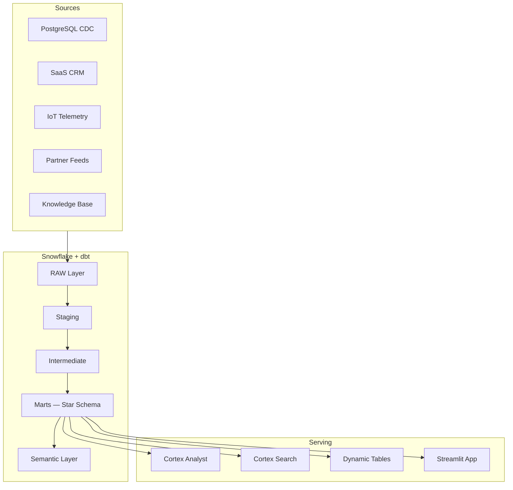

# 🏠 Lighthouse — AI-Ready Data Product Platform

A portfolio-grade data platform built on **Snowflake** and **dbt** for NordHjem Energy, a fictional Nordic connected-home and energy services company.

## Architecture



## Key Capabilities

- **5 ingestion patterns** — CDC, SaaS, batch, streaming, unstructured (simulated with synthetic data)
- **3-layer dbt ELT** — staging → intermediate → marts (Kimball star schema)
- **6 data products** — Customer 360, Contract & Revenue, Device & Usage, Service Ops, Reference, AI-Ready Knowledge
- **Dual semantic layer** — dbt MetricFlow + Snowflake Semantic Views for Cortex Analyst
- **Governance** — classification tags, dynamic masking, row-level security
- **CI/CD** — GitHub Actions for PR validation and production deployment

## Prerequisites

- Snowflake Enterprise Edition account (trial works)
- Python 3.11+
- dbt-snowflake (`pip install dbt-snowflake`)

## Quick Start

```bash
# 1. Deploy Snowflake infrastructure
snowsql -f snowflake/infrastructure/deploy.sql -D env=DEV

# 2. Load seed data
snowsql -f snowflake/ingestion/load_oltp_seeds.sql
snowsql -f snowflake/ingestion/load_crm_seeds.sql
snowsql -f snowflake/ingestion/load_iot_seeds.sql
snowsql -f snowflake/ingestion/load_partner_feeds.sql
snowsql -f snowflake/ingestion/load_knowledge_base.sql
snowsql -f snowflake/ingestion/chunk_documents.sql

# 3. Configure dbt
cp dbt/profiles.yml.example ~/.dbt/profiles.yml
# Edit with your Snowflake credentials

# 4. Run dbt
cd dbt
dbt deps
dbt seed
dbt snapshot
dbt build
dbt test
```


## Repository Structure

```
lighthouse/
├── dbt/                    # dbt transformation project
│   ├── models/
│   │   ├── staging/        # Source-conforming standardization
│   │   ├── intermediate/   # Business logic and harmonization
│   │   └── marts/          # Kimball star schema (dims + facts)
│   ├── snapshots/          # SCD Type 2 snapshots
│   ├── seeds/              # Static reference data
│   ├── macros/             # Custom macros and generic tests
│   └── tests/              # Unit and generic tests
├── snowflake/
│   ├── infrastructure/     # Idempotent setup scripts
│   ├── ingestion/          # Seed data loading scripts
│   ├── governance/         # Tags, masking, row access policies
│   ├── semantic/           # Cortex Analyst semantic views
│   ├── cortex/             # Cortex Search service
│   ├── serving/            # Dynamic Tables
│   └── monitoring/         # Cost and performance monitoring
├── streamlit/              # Streamlit in Snowflake app
├── data/                   # Synthetic seed data
├── docs/                   # ADRs, architecture docs
└── .github/workflows/      # CI/CD pipelines
```

## Performance Considerations

- **Clustering keys** on `date_key` for high-volume fact tables
- **Warehouse sizing** per workload: X-Small for ingestion, Small for transforms, Medium for AI
- **Auto-suspend** configured per warehouse (60-120s) to minimize idle costs
- **Resource monitors** with credit quota alerts at 75%, 90%, and auto-suspend at 100%
- **Incremental materialization** for high-volume staging models (IoT, CDC)

## Documentation

- [Ingestion Architecture](docs/ingestion-architecture.md)
- [Semantic Layer Mapping](docs/semantic-layer-mapping.md)
- [Governance Mapping](docs/governance-mapping.md)
- [Data Mesh Evolution](docs/data-mesh-evolution.md)
- [ADRs](docs/adr/)
