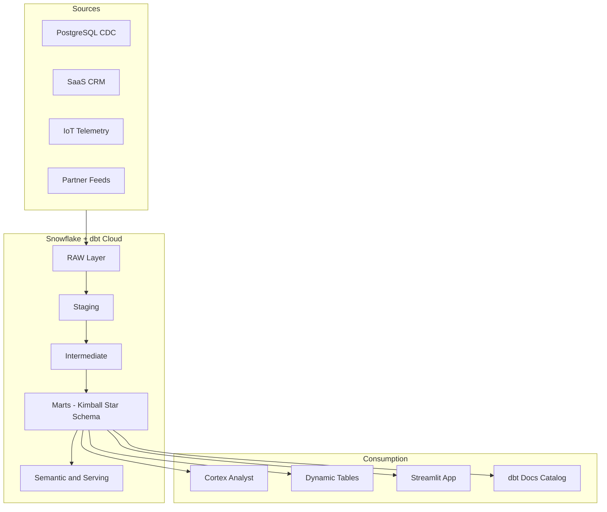

# Lighthouse - AI-Ready Data Product Platform

Lighthouse is a portfolio-grade data platform for NordHjem Energy, a fictional Nordic connected-home and energy services company.

Version 1 of the project is designed to run with:
- Snowflake for infrastructure, ingestion, semantic, serving, and app hosting
- dbt Cloud for transformation, testing, and documentation
- GitHub as the source of truth

## Primary Operating Model

The primary workflow is:
1. GitHub stores the codebase
2. Snowflake hosts raw, analytics, semantic, serving, and Streamlit assets
3. dbt Cloud runs the dbt project in `dbt/`

The recommended setup path is documented in:
- `docs/setup-snowflake-dbt-cloud.md`

The warehouse design in Kimball terms is documented in:
- `docs/kimball-architecture.md`

## Architecture



## Key Capabilities

- 4 ingestion patterns: CDC, SaaS, batch, telemetry
- 3-layer dbt ELT: staging -> intermediate -> marts
- Kimball dimensional marts with conformed dimensions, facts, and bridges
- Customer 360, billing, device, and service data products
- Snowflake-native semantic, serving, and app layers
- dbt tests, contracts, snapshots, unit tests, and docs catalog

## Quick Start

For the hosted setup, use this flow:

1. Run Snowflake infrastructure deployment in Snowsight
2. Run the raw-load orchestrator in Snowflake
3. Configure dbt Cloud against the `dbt/` subdirectory
4. Run:

```bash
dbt deps
dbt seed
dbt build
dbt docs generate
```

5. Run the Snowflake post-dbt orchestrator
6. Create the Streamlit app in Snowflake

Do not use the old CLI-first run order as the default hosted path.

## Repository Structure

```text
lighthouse/
|-- dbt/                    # dbt transformation project
|   |-- models/
|   |   |-- staging/        # source-conforming cleanup and deduplication
|   |   |-- intermediate/   # integration and harmonization logic
|   |   `-- marts/          # Kimball dimensions, facts, bridges, data products
|   |-- snapshots/          # SCD Type 2 snapshots
|   |-- seeds/              # static reference data
|   |-- macros/             # custom macros and generic tests
|   `-- tests/              # generic and unit tests
|-- snowflake/
|   |-- infrastructure/     # idempotent setup scripts
|   |-- ingestion/          # local CLI-oriented loaders
|   |-- ingestion_web/      # Snowsight-friendly loaders
|   |-- orchestration/      # bootstrap and post-dbt entrypoints
|   |-- semantic/           # semantic objects
|   |-- serving/            # Dynamic Tables and serving SQL
|   `-- ...
|-- streamlit/              # Streamlit in Snowflake app
|-- data/                   # synthetic source data
|-- docs/                   # setup, architecture, ADRs, modeling docs
`-- .github/workflows/      # CI/CD pipelines
```

## Important Notes

- `snowflake/ingestion/` remains useful as a local fallback path, but it is not the primary hosted workflow.
- `snowflake/orchestration/bootstrap_orchestrator.sql` is the preferred Snowflake-side bootstrap entrypoint.
- `snowflake/orchestration/post_dbt_orchestrator.sql` is the preferred Snowflake-side post-dbt entrypoint.
- The service area now follows a Kimball pattern with a ticket-grain fact and a ticket-to-customer bridge.
- Unsupported or non-used branches have been removed so Version 1 only reflects the working platform.

## Documentation

- `docs/setup-snowflake-dbt-cloud.md`
- `docs/kimball-architecture.md`
- `docs/ingestion-architecture.md`
- `docs/semantic-layer-mapping.md`
- `docs/data-product-catalog.md`
- `docs/adr/`
