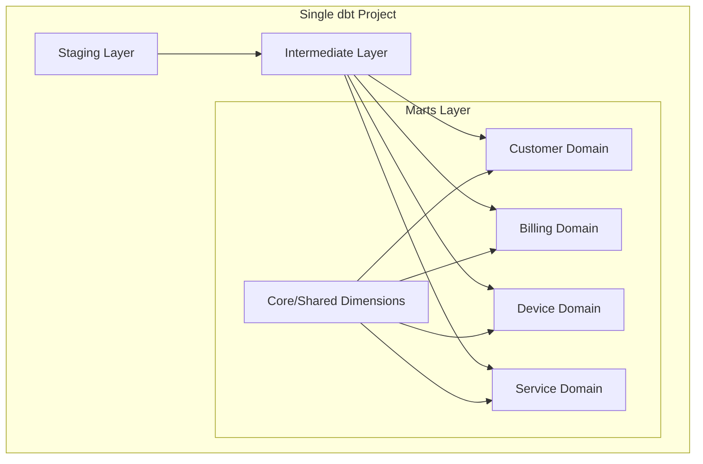
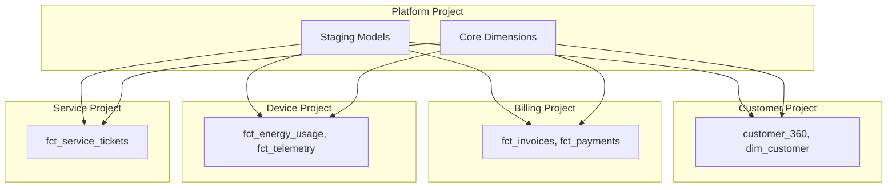

# Data Mesh Evolution — Migration Path

## Current State: Single dbt Project

All four domains (customer, billing, device, service) live in one dbt project with domain-aligned groups and model access controls.

## Target State: dbt Mesh (Multi-Project)

## Migration Steps

1. Validate domain boundaries — ensure no `protected` model is referenced across groups
2. Extract Platform project — staging + core dimensions
3. Extract domain projects — one per domain with own `dbt_project.yml`
4. Configure cross-project references — `{{ ref('project_name', 'model_name') }}`
5. Set up per-project CI/CD
6. Configure Snowflake Secure Data Sharing for cross-account access if needed

## Organizational Prerequisites

- Each domain has a dedicated team or owner
- Clear data product contracts (already enforced via dbt model contracts)
- Shared understanding of conformed dimensions (Platform team owns)
- Per-domain CI/CD pipelines
